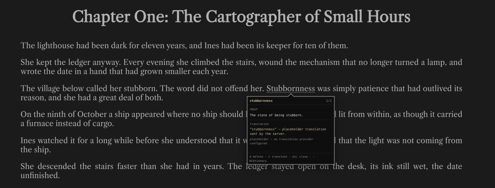
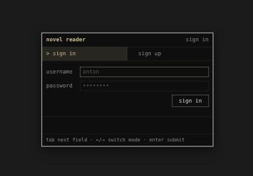
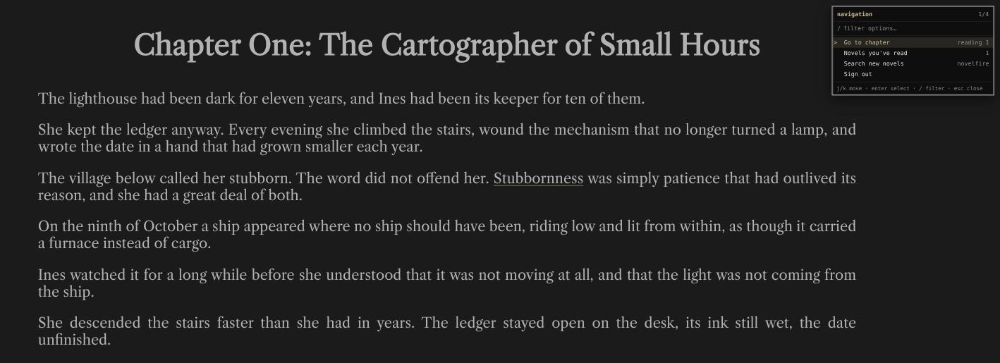
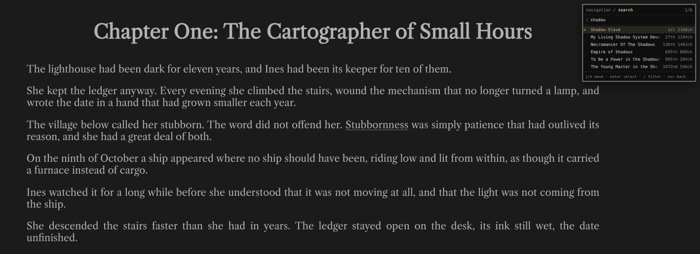

# Novel Reader

A keyboard-driven web reader for serialised novels, with a dictionary built into the page.

Select a word, press `d`, and the definition appears in a panel pointing at it. Save the words
you look up and they stay underlined everywhere you meet them again. The reader remembers
where you stopped — down to the paragraph — and puts it back at the bottom of the screen when
you return.



## What it does

- **Reads by the chapter.** A whole chapter arrives in one request and is cached in MongoDB,
  so the source site is fetched once per chapter and the next one is warmed in the background
  while you read.
- **Defines words in place.** Wiktionary first, [dictionaryapi.dev](https://dictionaryapi.dev)
  as a fallback, cached by term. Senses page with `j`/`k`.
- **Remembers your vocabulary.** Saved words are underlined in every chapter, and clicking one
  reopens its definition.
- **Remembers your place.** The last paragraph actually on screen is recorded once you stop
  scrolling — one request, not one per scroll event. Reopening restores that paragraph to the
  bottom of the viewport, loading the previous chapter too when the bookmark sits near the top
  of its own.
- **Keeps a library.** Novels you have read are listed with their title, rank and chapter
  count, refreshed from the catalogue once a day.
- **Searches for new novels**, with results as you stop typing.
- **Accounts.** Sign up, sign in, and a per-reader library and vocabulary.

Everything is driven from the keyboard, and every panel is drawn in the same TUI style.

## Screenshots

**Sign in / sign up** — two fields, two modes, and failures shown in place rather than by
reloading:



**The navigation menu** (`n`) — a stack of screens with a breadcrumb, filter and hint bar:



**Searching the catalogue.** Results arrive 1.5 s after you stop typing. A title too long for
its row fades out over its last characters rather than being clipped, so the rank and chapter
count keep their place:



## Quick start

```bash
./run.sh
```

That starts MongoDB in a container, restores the SignalR client, builds everything (including
the TypeScript), and opens the app at <http://localhost:5261>. Sign up, and you start reading.

```bash
./run.sh --https     # the https profile instead
./run.sh --stop      # stop the Mongo container
./run.sh --clean     # remove the container and its data volume
./run.sh --help
```

The Mongo container is left running after `Ctrl-C` so cached chapters survive a restart.

### Prerequisites

`run.sh` checks for these and tells you what is missing:

- **.NET 10 SDK**, plus the ASP.NET Core runtime and targeting pack. On Arch:
  `sudo pacman -S aspnet-runtime aspnet-targeting-pack`
- **Node.js** — the TypeScript client is compiled during `dotnet build`.
- **Podman** — for the MongoDB container.

Accounts live in a local SQLite file created on first run. Nothing else needs setting up.

### Running the tests

```bash
dotnet test NovelReader.sln     # 112 tests
cd WebApi && npm run typecheck  # client types
```

## Keyboard

Keys are dispatched through a stack of modes, so the innermost thing on screen gets them first
and the bindings underneath come back untouched when it closes.

**Reading**

| Key | |
|---|---|
| `j` / `k` | scroll down / up |
| `d` | define the selected word |
| `s` | save the selected word |
| `n` | open the navigation menu |

**With a definition open**

| Key | |
|---|---|
| `j` / `k` | next / previous sense |
| `s` / `d` | save / delete the word |
| `t` | translate |
| `Esc` | close |

**In the navigation menu**

| Key | |
|---|---|
| `j` / `k`, arrows | move |
| `g` / `G` | first / last |
| `Enter` | select |
| `/` | filter — or, on the search screen, query the catalogue |
| `Esc` | back one screen, and close at the root |

In the chapter list you can type **any** chapter number, including one outside the range shown,
and it will try to fetch it.

## How it is built

Seven projects, with dependencies pointing inward at `NovelReader.Domain`, which has **zero
package references** and holds the interfaces, POCOs and pure logic.

| Project | |
|---|---|
| `NovelReader.Domain` | contracts and business logic — reading, vocabulary, accounts, the library |
| `NovelReader.Retrievers` | scrapes chapters and queries the catalogue |
| `NovelReader.Dictionary` | Wiktionary and dictionaryapi.dev providers, with fallback |
| `NovelReader.Data.Mongo` | chapters, vocabulary, bookmarks, prepared-chapter cache |
| `NovelReader.Data.Sqlite` | user accounts |
| `WebApi` | ASP.NET Core host, SignalR hub, and the TypeScript client |
| `NovelReader.Tests` | xUnit |

The frontend is TypeScript with **no framework and no bundler** — `tsc` emits browser-native
ES modules straight into `wwwroot/`. The three panels (definition box, navigation menu, login)
share one palette in `wwwroot/tui.css`.

Chapters are stored one document per chapter, per novel; bookmarks one document per
(reader, novel). Passwords are hashed with PBKDF2-HMAC-SHA256, and the hub takes the reader
from the authentication cookie rather than from anything the client sends.

## Status and limitations

This is a working personal reader, not a finished product. Worth knowing:

- **Translation (`t`) is a stub.** The round trip works end to end, but the server answers with
  a clearly-labelled placeholder — no provider is configured, and the language pair is still an
  open question.
- **Chapter counts are not known per novel**, so the chapter menu shows a window around where
  you are and "next chapter" discovers the end of a novel by trying it.
- **Accounts have no password reset**, no password change, and no rate limit on sign-in.
- **Scraping is fragile by nature.** The source site occasionally answers `200` with an empty
  page, and its "this page moved" notice is recognised by its wording — if that wording
  changes, so must the code.
- Progressive-web-app support is deliberately deferred.

## The documentation

- [`CLAUDE.md`](CLAUDE.md) — how the codebase fits together, and the traps worth knowing before
  changing it.
- [`DECISIONS.md`](DECISIONS.md) — why things are the way they are, one decision per entry.
- [`TASKS.md`](TASKS.md) — what has been built, what was verified and how, and what is still open.

## A note on the source

The reader fetches chapters from a public novel site for personal reading, caching each chapter
once so the site is not fetched repeatedly. It is not a scraper for redistribution, and no
chapter text is included in this repository — the prose in the screenshots above was written
for them.
